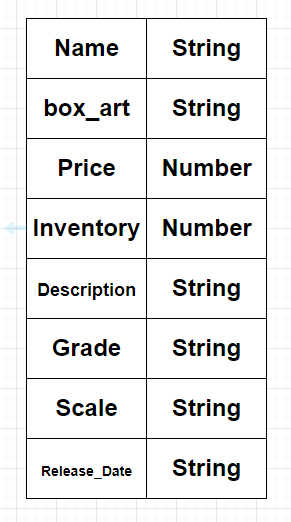
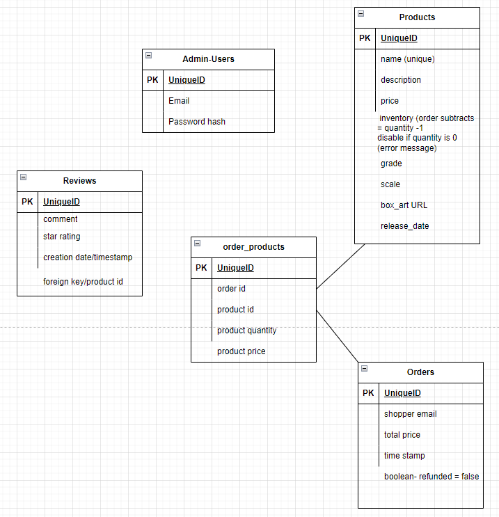

# Gunpla Galaxy

### Christian Alexander

## Description
This is the backend that will store all the items, inventory, and user data.

## Links
Trello Board
- https://trello.com/b/oQuGD0QS/gunpla-galaxy?openListComposer=true

Render Deploy

## Schema

## ERD

## Route Map
| Route name  | endpoint | method | Description                 |
| ----------- | -------- | ------ | --------------------------- |
| Index | /products   | GET    | Renders all products |
| Create | /products  | POST    | Adds a product to the database |
| Update | /products/:id   |  PUT   | Updates a product based on id |
| Delete | /products/:id   | DELETE   | Removes a product from the database |
| Show | /products/:id   | GET    | Renders a product based on id |